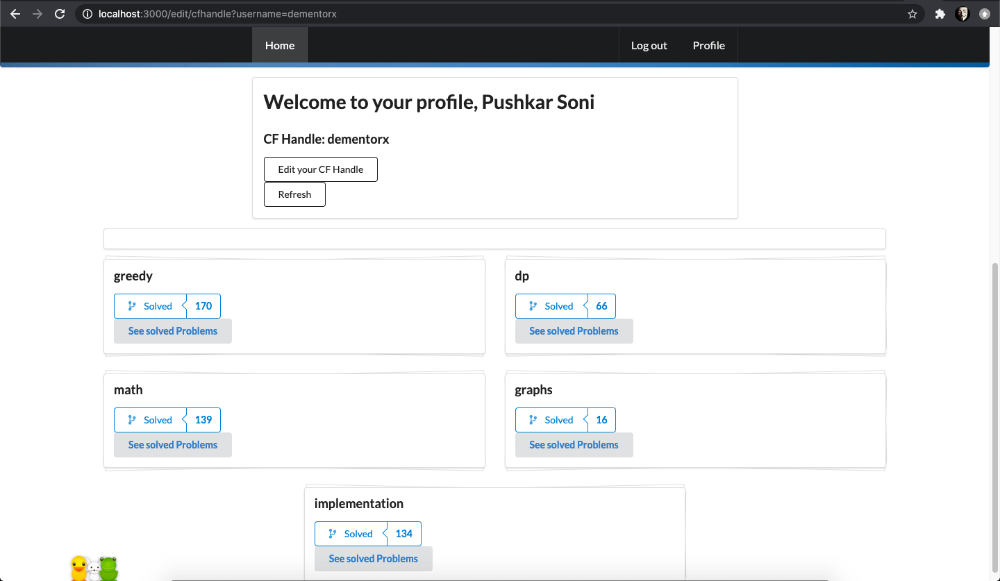

# CFAPI
Website Using Codeforces API
Website built for purpose of analizing problem solved by Contestant. Analizing problems with submissions and their tags only.
Website built using Node.js for backend and html, jquery and css for frontend.
various Javascript frameworks like express, request, OAuth, Ajax, passport , ejs, mongodb, mongoose , mocha.
Requires Data structures and Algorithmic steps to analyse submissions by a contestant.

