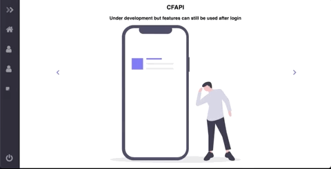

# CFAPI


## Highlights

Website built for purpose of analyzing problem solved by Contestant.Saving Notes to problems and Separate Notes Page. Analyzing problems with submissions and their tags only.

Website built using Node.js for backend and html, jquery and css for frontend.

various Javascript frameworks like express, request, OAuth, Ajax, passport , ejs, mongodb, mongoose , mocha.


## Profile Page
- Page for Checking all Tags and no of questions solved for each tag.
- **OAuth** and **Passport** used for Login
- This page Fetches All details for Codeforces User using Codeforces **API**
- Store all the information in **Mongodb** database for fast access in future.
- Handle can be edited.


```console
```
## User Notes
- Edit/Add notes To the Database
- **Ajax** Used to to send and receive requests asynchronously to the Database , Updating Css dynamically on success.


``` console
```
## All problems page
- See all the solved problems and add notes to them
- add them to custom lists of your own.


``` console
```
## Future Plans

1. ~~changing design of website, removing semantic ui framework~~ (DONE)
2. ~~create own topic lists and add problems to it~~ (DONE)
3. ~~ajax for saving notes to a problem~~ (DONE)
4. move to web scrapping instead of cf API
5. upcomming contests date
6. Implementation of dark mode
8. for small screen devices.
